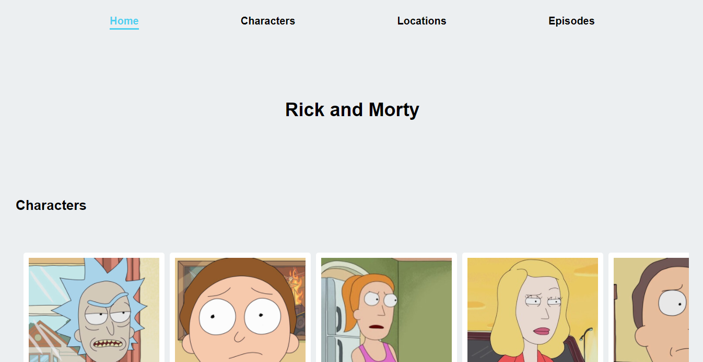

# Rick-and-Morty
A simple project using the rick and morty api.

This project was made with React and Sass as CSS preprocesor.

Link: [https://rick-and-morty.tuentyfaiv.vercel.app/](https://rick-and-morty.tuentyfaiv.vercel.app/)

## How to install
- `npm install`

## How to run
- `npm start`

